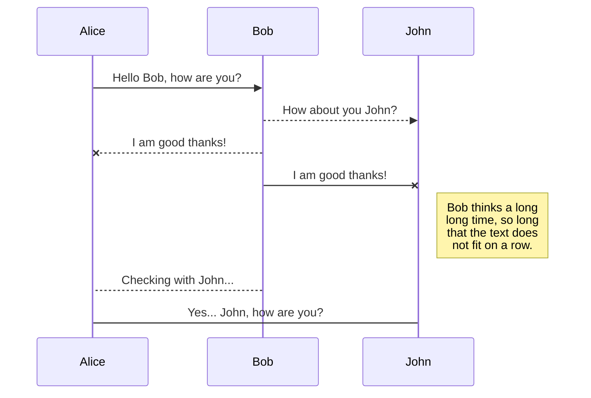

# Welcome to StackEdit!

Hi! I'm your fiertwertwer

 - srgretret`drtyertyrety java`
 - sagtretrere
 - ertert
 - ert

# Files

Stacretretretret
All your files and folders are presented as a tree in the file explorer. You can switch from one to another by clicking a file in the tree.

## Rename a file

You can rename the current file by clicking the file name in the navigation bar or by clicking the **Rename** button in the file explorer.

## Delete a file

You can delete the current file by clicking the **Remove** button in the file explorer. The file will be moved into the **Trash** folder and automatically deleted after 7 days of inactivity.

## Export a file

You can export the current file by clicking **Export to disk** in the menu. You can choose to export the file as plain Markdown, as HTML using a Handlebars template or as a PDF.


# Synchronization

SynchronizJava Spring Boot - REST API and Kafka Message Publishing

WP Production: [https://www.codenow.com/docs/complex-examples/java-spring-boot/java-spring-boot-rest-api-and-kafka-message-publishing/](https://www.codenow.com/docs/complex-examples/java-spring-boot/java-spring-boot-rest-api-and-kafka-message-publishing/)

WP Staging: [https://m0e.6ae.myftpupload.com/wp-admin/post.php?action=edit&post=7070](https://m0e.6ae.myftpupload.com/wp-admin/post.php?action=edit&post=7070)

  

🕓 40 minutes

  

## What you’ll learn

How to setup your application for :

-   connecting to Kafka and publishing messages to its’ topic,
    
-   getting data from REST API,
    
-   providing data to REST API.
    

  

In this tutorial, we will create a simple java component with the Java Spring Boot scaffolder. We want to expose a single REST endpoint for getting client data. Client data is provided by another REST component client-data-db, so we need to configure a spring rest call for it. Any access to client data should be logged in the Kafka topic, so we need a Kafka client configuration ias one of the biggest features of StackEdit. It enables you to synchronize any file in your workspace with other files stored in your **Google Drive**, your **Dropbox** and your **GitHub** accounts. This allows you to keep writing on other devices, collaborate with people you share the file with, integrate easily into your workflow... The synchronization mechanism takes place every minute in the background, downloading, merging, and uploading file modifications.

There are two types of synchronization and they can complement each other:

- The workspace synchronization will sync all your files, folders and settings automatically. This will allow you to fetch your workspace on any other device.
	> To start syncing your workspace, just sign in with Google in the menu.

- The file synchronization will keep one file of the workspace synced with one or multiple files in **Google Drive**, **Dropbox** or **GitHub**.
	> Before starting to sync files, you must link an account in the **Synchronize** sub-menu.

## Open a file

You can open a file from **Google Drive**, **Dropbox** or **GitHub** by opening the **Synchronize** sub-menu and clicking **Open from**. Once opened in the workspace, any modification in the file will be automatically synced.

## Save a file

You can save any file of the workspace to **Google Drive**, **Dropbox** or **GitHub** by opening the **Synchronize** sub-menu and clicking **Save on**. Even if a file in the workspace is already synced, you can save it to another location. StackEdit can sync one file with multiple locations and accounts.

## Synchronize a file

Once your file is linked to a synchronized location, StackEdit will periodically synchronize it by downloading/uploading any modification. A merge will be performed if necessary and conflicts will be resolved.

If you just have modified your fwell.

  


  

## Project source

This example project can be cloned from: [git@gitlab.factory.innobank.codenow.com](mailto:git@gitlab.factory.innobank.codenow.com):innobank/client-data-service.git

## Prerequisites

-   Prepare your local development environment for CodeNOW with Java Spring Boot.
    

-   Follow the tutorial instructions in [Java Spring Boot Local Development](https://www.codenow.com/docs/local-development-for-codenow/java-spring-boot-local-development/).
    

-   Run Apache Kafka locally.
    

-   Use docker compose as described in the section Docker compose and third-party tools of the [Java Spring Boot Local Development](https://www.codenow.com/docs/local-development-for-codenow/java-spring-boot-local-development/) tutorial.
    

-   Create a new component
    

-   For details see the section Prerequisites of the  [Java Spring Boot Local Development](https://www.codenow.com/docs/local-development-for-codenow/java-spring-boot-local-development/) tutorial.
    

## Steps

Open your IDE, import the created component and start coding:

  

-   Define the message payload. Here is an example of the Client, which is a simple POJO with basic client data:
    

-   generate getters and setters with your IDE
    

[java]

package io.codenow.client.data.service.model;

  

import java.time.LocalDate;

  

public class Client {

private String username;

private String firstname;

private String surname;

private LocalDate birthdate;

  

}

[/java]

  

-   Next prepare the configuration for the Kafka logging client:
    

-   Go to the Kafka administration console ([http://localhost:9000](http://localhost:9000) if using Kafdrop from our [Java Spring Local Development](https://www.codenow.com/docs/local-development-for-codenow/java-spring-boot-local-development/) manual.) and create a new topic client-logging
    
-   Add maven dependency to your pom.xml
    

[code]

<dependency>

<groupId>org.springframework.kafka</groupId>

<artifactId>spring-kafka</artifactId>

</dependency>

[/code]

  

-   For more detailes and you want to force syncing, click the **Synchronize now** button in the navigation bar.

> **Note:** The **Synchronize now** button is disabled if you have no file to synchronize.

## Manage file synchronization

Since one file can be synced with multiple locations, you can list and manage synchronized locations by clicking **File synchronization** in the **Synchronize** sub-menu. This allows you to list and remove synchronized locations that are linked to your file.


# Publication

Publishing in StackEdit makes it simple for you to publish online your files. Once you're happy with a file, you can publish it to different hosting platforms like **Blogger**, **Dropbox**, **Gist**, **GitHub**, **Google Drive**, **WordPress** and **Zendesk**. With [Handlebars templates](http://handlebarsjs.com/), you have full control over what you export.

> Before starting to publish, you must link an account in the **Publish** sub-menu.

## Publish a File

You can publish your file by opening the **Publish** sub-menu and by clicking **Publish to**. For some locations, you can choose between the following formats:

- Markdown: publish the Markdown text on a website that can interpret it (**GitHub** for instance),
- HTML: publish the file converted to HTML via a Handlebars template (on a blog for example).

## Update a publication

After publishing, StackEdit keeps your file linked to that publication which makes it easy for you to re-publish it. Once you have modified your file and you want to update your publication, click on the **Publish now** button in the navigation bar.

> **Note:** The **Publish now** button is disabled if your file has not been published yet.

## Manage file publication

Since one file can be published to multiple locations, you can list and manage publish locations by clicking **File publication** in the **Publish** sub-menu. This allows you to list and remove publication locations that are linked to your file.


# Markdown extensions

StackEdit extends the standard Markdown syntax by adding extra **Markdown extensions**, providing you with some nice features.

> **ProTip:** You can disable any **Markdown extension** in the **File properties** dialog.


## SmartyPants

SmartyPants converts ASCII punctuation characters into "smart" typographic punctuation HTML entities. For example:

|                |ASCII                          |HTML                         |
|----------------|-------------------------------|-----------------------------|
|Single backticks|`'Isn't this fun?'`            |'Isn't this fun?'            |
|Quotes          |`"Isn't this fun?"`            |"Isn't this fun?"            |
|Dashes          |`-- is en-dash, --- is em-dash`|-- is en-dash, --- is em-dash|


## KaTeX

You can render LaTeX mathematical expressions using [KaTeX](https://khan.github.io/KaTeX/):

The *Gamma function* satisfying $\Gamma(n) = (n-1)!\quad\forall n\in\mathbb N$ is via the Euler integral

$$
\Gamma(z) = \int_0^\infty t^{z-1}e^{-t}dt\,.
$$

> You can find more information about **LaTeX** mathematical expressions [here](http://meta.math.stackexchange.com/questions/5020/mathjax-basic-tutorial-and-quick-reference).


## UML diagrams

You can render UML diagrams using [Mermaid](https://mermaidjs.github.io/). For example, this will produce a sequence diagram:



And this will produce a flow chart:

```mermaid
graph LR
A[Square Rect] -- Link text --> B((Circle))
A --> C(Round Rect)
B --> D{Rhombus}
C --> D
```bout spring-kafka, see: [https://spring.io/projects/spring-kafka](https://spring.io/projects/spring-kafka)
    
-   Now add the configuration for the Kafka template to your Application.java (package io.codenow.client.data.service):
    

[java]

### @Value("${kafka.broker.url}") private String kafkaBrokerUrl;

  

@Bean

public ProducerFactory<String, String> producerFactory() {

return new DefaultKafkaProducerFactory<>(producerConfigs());

}

  

@Bean

public Map<String, Object> producerConfigs() {

Map<String, Object> props = new HashMap<>();

props.put(ProducerConfig.BOOTSTRAP_SERVERS_CONFIG, kafkaBrokerUrl);

props.put(ProducerConfig.KEY_SERIALIZER_CLASS_CONFIG, StringSerializer.class);

props.put(ProducerConfig.VALUE_SERIALIZER_CLASS_CONFIG, StringSerializer.class);

// See https://kafka.apache.org/documentation/#producerconfigs for more properties

return props;

}

  

@Bean

public KafkaTemplate<String, String> kafkaTemplate() {

return new KafkaTemplate<String, String>(producerFactory());

}

[/java]

  
  

-   Next, create a new controller and put all the parts together
    

-   For more details about the spring REST controller, see: [https://spring.io/guides/gs/rest-service/](https://spring.io/guides/gs/rest-service/)
    

  

[java]

package io.codenow.client.data.service.controller;

  

import org.slf4j.Logger;

import org.slf4j.LoggerFactory;

import org.springframework.beans.factory.annotation.Value;

import org.springframework.kafka.core.KafkaTemplate;

import org.springframework.web.bind.annotation.GetMapping;

import org.springframework.web.bind.annotation.PathVariable;

import org.springframework.web.bind.annotation.RequestMapping;

import org.springframework.web.bind.annotation.RestController;

import org.springframework.web.reactive.function.client.WebClient;

  

import io.codenow.client.data.service.model.Client;

import reactor.core.publisher.Flux;

  

@RestController

@RequestMapping("/data")

public class ClientDataController {

private static final Logger LOG = LoggerFactory.getLogger(ClientDataController.class);

  

private String clientDataDBURL;

private String kafkaTopicName;

private String kafkaTopicKey;

private KafkaTemplate<String, String> kafkaTemplate;

  
  

public ClientDataController(@Value("${endpoint.client.data.db}") String clientDataDBURL, @Value("${kafka.topic.name}") String kafkaTopicName, KafkaTemplate<String, String> kafkaTemplate, @Value("${kafka.topic.key}") String kafkaTopicKey) {

super();

this.clientDataDBURL = clientDataDBURL;

this.kafkaTopicName = kafkaTopicName;

this.kafkaTemplate = kafkaTemplate;

this.kafkaTopicKey = kafkaTopicKey;

}

  

@GetMapping("/{username}")

private Flux<Client> getClientData(@PathVariable String username) {

LOG.info("Get data for username: {}", username);

kafkaTemplate.send(kafkaTopicName, kafkaTopicKey, username);

  

Flux<Client> clientFlux = WebClient.create().get().uri(clientDataDBURL + "/db/clients/" + username).retrieve()

.bodyToFlux(Client.class);

  

clientFlux.subscribe(client -> LOG.info(client.toString()));

return clientFlux;

  

}

}

[/java]

  
  

-   Last but not least, append the configuration for Kafka to config/application.yaml
    

-   Note that this configuration depends on your local development setup for Kafka and can differ case-by-case.
    
-   Make sure you follow yaml syntax (especially whitespaces)
    

[code]

endpoint:

client:

data:

db: http://client-data-db

kafka:

broker:

url: client-logging-kafka-kafka-brokers.managed-components:9092

topic:

name: client-logging

key: client-data-service

[/code]

  

-   Try to build and run the application in your IDE. After startup, you should be able to access your new controller’s swagger: http://localhost:8080/swagger/index.html
    


  
  

## What’s next?

If your code works in the local development, you are ready to push your changes to GIT and try to build and deploy your new component version to the CodeNOW environment. For more information see [Application Deployment](https://www.codenow.com/docs/administration-manuals/deploy-application/) and [Monitoring](https://www.codenow.com/docs/administration-manuals/deployment-monitoring/), just make sure to change the application.yaml properties from the local to the production setup.

-   Check [Get New Apache Kafka](https://www.codenow.com/docs/managed-components-administration/get-new-apache-kafka/) for setup in the CodeNOW environment.
<!--stackedit_data:
eyJoaXN0b3J5IjpbMjEwODY0NDk2Ml19
-->